# Prologue Choice Tree — Ryoko Owari Nights

Authoritative source: `game/prologue.rpy`.  
Companion docs: [first-scene-analysis.md](./first-scene-analysis.md), [cg-choice-map.md](./cg-choice-map.md).

---

## Legend

| Symbol | Meaning |
|--------|---------|
| **◇** | Choice menu (player decision) |
| **▣** | Merge point — all incoming branches share the same trunk |
| **★** | Canon true route (physical unless → signed permit) |
| **⏱** | Case 1 hook timing |
| `→` | Linear beat (no menu) |
| Dashed style in diagram | Shared trunk / merge node |

**Stats touched:** `honor`, `composure`, `compliance`, `insight`, `rebuke`, `performance_boldness`, `physical_initiative`, `kaoru_submission`, `kaoru_resistance`, `kaoru_formality`.

**Endings:** Canon (signed, +3 days) · Verbal (unresolved seal, +3 weeks) · Walkout (+3 weeks) · Refuse leave (bad end, no Case 1).

---

## Full flowchart

```mermaid
flowchart TD
    classDef canon fill:#2d5016,stroke:#7cb342,color:#fff,stroke-width:3px
    classDef merge fill:#1a237e,stroke:#7986cb,color:#fff
    classDef ending fill:#4a148c,stroke:#ce93d8,color:#fff
    classDef badend fill:#b71c1c,stroke:#ef5350,color:#fff
    classDef menu fill:#37474f,stroke:#90a4ae,color:#fff

    subgraph Corridor["Corridor — Beat 1–2"]
        START([prologue_start]) --> CORRIDOR[cg corridor_lost<br/>Lost in corridor]
        CORRIDOR --> WRONG[Wrong door — Kaoru slams]
        WRONG --> DOOR_MENU{◇ Door slam<br/>prologue_door_menu}
    end

    subgraph Door["Door + second chance"]
        DOOR_MENU -->|Leave<br/>honor+1| LEAVE[Leave — find another office]
        DOOR_MENU -->|Knock again<br/>composure+1| FORMAL_KNOCK
        DOOR_MENU -->|Wait quietly<br/>kaoru_submission+1, compliance+1| FORMAL_KNOCK

        LEAVE -->|first time| LOOP[Corridor loop — clerk sends her back]
        LEAVE -->|door_left_once| LOOP2[Every sign points back]
        LOOP --> SECOND{◇ Second chance<br/>prologue_door_second_chance}
        LOOP2 --> SECOND

        SECOND -->|Knock again<br/>composure+1| FORMAL_KNOCK
        SECOND -->|Wait quietly<br/>kaoru_submission+1, compliance+1| FORMAL_KNOCK
    end

    subgraph Formality["Formality — Beat 3–5"]
        FORMAL_KNOCK[▣ Formal knock<br/>bg magistrate_office]:::merge
        FORMAL_KNOCK --> FORM_MENU{◇ Formality<br/>prologue_formality_menu}

        FORM_MENU -->|Hyper-formal<br/>kaoru_formality=1, kaoru_submission+1| HF[Hyper-formal address]
        FORM_MENU -->|Direct<br/>honor+1, kaoru_resistance+1| DIR[Direct and plain]
        FORM_MENU -->|Humorous<br/>insight+1| HUM[Light humor]

        HF --> PITCH
        DIR --> PITCH
        HUM --> PITCH[PITCH — newcomer intro<br/>flavor lines differ by tone]
    end

    subgraph Office["Office — Beat 5–6"]
        PITCH --> INTERCLAN[Interclan gate — door closes]
        INTERCLAN --> ENTER_MENU{◇ Enter office<br/>prologue_enter_office_menu}

        ENTER_MENU -->|Comply<br/>discipline_check=0, composure+1| COMPLY[Eyes forward]
        ENTER_MENU -->|Peek shelves<br/>discipline_check=1, insight+1| PEEK[Catalog trophies]

        COMPLY --> PERMIT_DESK
        PEEK --> PERMIT_DESK[▣ cg permit_desk<br/>Expired permit crisis]:::merge
    end

    subgraph Permit["Permit — Beat 6–7"]
        PERMIT_DESK --> EXPIRED{◇ Expired permit<br/>prologue_expired_menu}

        EXPIRED -->|Academy trip<br/>permit_strategy=academy_trip<br/>compliance+1, kaoru_submission+1| ACAD[Accept Academy trip]
        EXPIRED -->|Local fix<br/>permit_strategy=local_fix<br/>honor+1, kaoru_resistance+1| LOCAL[Push local fix]
        EXPIRED -->|Plead<br/>permit_strategy=plead<br/>composure+1| PLEAD[Plead — nowhere else]

        ACAD --> VACUUM
        LOCAL --> VACUUM
        PLEAD --> VACUUM[▣ Social vacuum<br/>prologue_social_vacuum]:::merge
    end

    subgraph Dance["Dance — Beat 8–10"]
        VACUUM --> DANCE_LECTURE[Dance disclosed — impress me]
        DANCE_LECTURE --> BEFORE{◇ Before dance<br/>prologue_before_dance_menu}

        BEFORE -->|Negotiate<br/>negotiated_terms=True, insight+1| NEG[Negotiate terms]
        BEFORE -->|Perform immediately<br/>performance_boldness+1, compliance+1| IMM[Perform now]
        BEFORE -->|Refuse<br/>prologue_refused_dance=True<br/>rebuke+2, kaoru_resistance+2| REFUSE_BAD

        NEG --> OFFICE_DANCE
        IMM --> OFFICE_DANCE

        REFUSE_BAD --> REFUSE_MENU{◇ Refuse recovery<br/>prologue_refuse_bad_end}
        REFUSE_MENU -->|Try again<br/>prologue_refused_dance=False| OFFICE_DANCE
        REFUSE_MENU -->|Leave office| REFUSE_END([Bad end — return<br/>Case 1 never starts]):::badend

        OFFICE_DANCE[▣ cg office_dance]:::merge --> PERF{◇ Performance<br/>prologue_performance_menu}

        PERF -->|Formal fan dance<br/>performance_style=formal_dance| FORMAL_P[Formal maiden narrative]
        PERF -->|Flirtatious<br/>performance_style=flirtatious<br/>performance_boldness+2, kaoru_resistance+1| FLIRT[Coquette sway]

        FORMAL_P --> WITHHELD
        FLIRT --> WITHHELD[▣ Withheld signature<br/>prologue_withheld_signature<br/>compliance+1]:::merge
    end

    subgraph Unless["Unless — Beat 11–13"]
        WITHHELD --> GRAB[Grab moment — wrist]
        GRAB --> GRAB_MENU{◇ Grab<br/>prologue_grab_menu}

        GRAB_MENU -->|Rebuke<br/>rebuke+2, kaoru_resistance+1| REBUKE[Pull back — defiance]
        GRAB_MENU -->|Lean in<br/>compliance+2, physical_initiative+1| LEAN[Don't break spell]

        REBUKE --> UNLESS_Q
        LEAN --> UNLESS_Q[▣ cg chair_tension<br/>Kaoru: Unless?]:::merge

        UNLESS_Q --> UNLESS{◇ Unless<br/>prologue_unless_menu}

        UNLESS -->|Verbal<br/>unless_branch=verbal<br/>insight+1, honor+1| VERBAL_END([Verbal ending<br/>No seal — teased hanko]):::ending
        UNLESS -->|Physical ★<br/>unless_branch=physical<br/>physical_initiative+2, compliance+1<br/>kaoru_submission+1| CANON_TAME([★ Tame canon<br/>fade-to-black embrace]):::canon
        CANON_TAME --> CANON_END([★ Canon ending<br/>permit_signed, canon_first_scene<br/>permit_effective_days=3]):::canon
        UNLESS -->|Walk out<br/>unless_branch=walk_out<br/>rebuke+2, kaoru_resistance+2| WALK_END([Walkout ending<br/>No seal — pride intact]):::ending
    end

    subgraph Endings["Endings + Case 1 hook"]
        VERBAL_END --> HOOK_3W[⏱ Three weeks later…]
        WALK_END --> HOOK_3W
        CANON_END --> HOOK_3D[⏱ Three days later…]

        HOOK_3W --> CASE1_NC[Case 1 hook — strained reopening<br/>unless_branch / permit_strategy flavor]
        HOOK_3D --> CASE1_C[Case 1 hook — early return<br/>guest room preview, signed permit]
        CASE1_NC --> RETURN([return — Case 1 loop])
        CASE1_C --> RETURN
    end
```



---

## ASCII mini-tree

```
START → corridor → wrong door
                    │
        ┌───────────┼───────────┐
     leave      knock_again   wait_quietly
        │           │              │
        └─► second_chance ────────┘
                    │
              formal_knock ◄── MERGE
                    │
        ┌───────────┼───────────┐
   hyper_formal   direct     humorous
        └───────────┴───────────┘
                    │
              enter_office
        ┌───────────┴───────────┐
      comply(0)            peek(1)
        └───────────┬───────────┘
                    │
              expired_permit ◄── MERGE
        ┌───────────┼───────────┐
  academy_trip  local_fix     plead
        └───────────┴───────────┘
                    │
           social_vacuum ◄── MERGE
                    │
        ┌───────────┼───────────┐
   negotiate    immediate      refuse ──► [leave = BAD END]
        └───────────┬───────────┘              │
                    │                    try again
              office_dance ◄── MERGE ─────────┘
        ┌───────────┴───────────┐
   formal_dance  flirtatious
        └───────────┬───────────┘
                    │
         withheld_signature ◄── MERGE
                    │
        ┌───────────┴───────────┐
      rebuke               lean_in
        └───────────┬───────────┘
                    │
              "Unless?" ◄── MERGE
        ┌───────────┼───────────┐
     verbal ★physical★      walk_out
        │           │              │
     3 weeks    3 days         3 weeks
        └───────────┴───────────┘
                    │
            prologue_case1_hook
```

---

## Menu → choices → flags → endings

| # | Menu label | Choice | Key variables / stats | Reaches | Ending impact |
|---|------------|--------|----------------------|---------|---------------|
| **1a** | Door slam | Leave | `door_response=leave`, `honor+1` → loops to second chance | Second chance menu | Trunk only |
| **1b** | Door slam | Knock again | `door_response=knock_again`, `composure+1` | Formal knock | Trunk only |
| **1c** | Door slam | Wait quietly | `door_response=wait_quietly`, `kaoru_submission+1`, `compliance+1` | Formal knock (Kaoru invites knock) | Trunk only |
| **1′** | Second chance | Knock again | `door_response=knock_again`, `composure+1` | Formal knock | Trunk only |
| **1″** | Second chance | Wait quietly | `door_response=wait_quietly`, stats as above | Formal knock | Trunk only |
| **2a** | Formality | Hyper-formal | `formality_tone=hyper_formal`, `kaoru_formality=1`, `kaoru_submission+1` | Shared pitch | Flavor at pitch + Case 1 tone |
| **2b** | Formality | Direct | `formality_tone=direct`, `honor+1`, `kaoru_resistance+1` | Shared pitch | Flavor at pitch |
| **2c** | Formality | Humorous | `formality_tone=humorous`, `insight+1` | Shared pitch | Flavor at pitch |
| **3a** | Enter office | Comply | `discipline_check=0`, `composure+1` | Permit desk | No shelf line at dance beat |
| **3b** | Enter office | Peek shelves | `discipline_check=1`, `insight+1` | Permit desk | Extra Kaoru line if `discipline_check==1` |
| **4a** | Expired permit | Academy trip | `permit_strategy=academy_trip`, `compliance+1`, `kaoru_submission+1` | Social vacuum | Case 1 flavor (non-canon) |
| **4b** | Expired permit | Local fix | `permit_strategy=local_fix`, `honor+1`, `kaoru_resistance+1` | Social vacuum | Case 1: "remedies" line |
| **4c** | Expired permit | Plead | `permit_strategy=plead`, `composure+1` | Social vacuum | Case 1: "no curry shop" line |
| **5a** | Before dance | Negotiate | `negotiated_terms=True`, `insight+1` | Office dance | Withheld-sig "terms" line; Case 1 if verbal |
| **5b** | Before dance | Perform immediately | `performance_boldness+1`, `compliance+1` | Office dance | Trunk only |
| **5c** | Before dance | Refuse | `prologue_refused_dance=True`, `rebuke+2`, `kaoru_resistance+2` | Refuse recovery | — |
| **5r** | Refuse recovery | Try again | clears `prologue_refused_dance` | Office dance | Rejoins trunk |
| **5r** | Refuse recovery | Leave office | — | `return` | **Bad end** — no Case 1 |
| **6a** | Performance | Formal fan dance | `performance_style=formal_dance` | Withheld signature | Continue flavor text |
| **6b** | Performance | Flirtatious | `performance_style=flirtatious`, `performance_boldness+2`, `kaoru_resistance+1` | Withheld signature | Extra hungry line; Case 1 flirt callback if canon |
| **7a** | Grab | Rebuke | `rebuke+2`, `kaoru_resistance+1` | Unless? | Affects Case 1 if walkout + `rebuke>=2` |
| **7b** | Grab | Lean in | `compliance+2`, `physical_initiative+1` | Unless? | Favors canon physical unless |
| **8a** | Unless? | Verbal | `unless_branch=verbal`, `insight+1`, `honor+1` | Verbal ending → **3 weeks** | No `permit_signed` |
| **8b** | Unless? | **Physical ★** | `unless_branch=physical`, `physical_initiative+2`, `compliance+1`, `kaoru_submission+1` | `prologue_canon_tame` → **3 days** | `permit_signed`, `canon_first_scene`, `permit_effective_days=3` |
| **8c** | Unless? | Walk out | `unless_branch=walk_out`, `rebuke+2`, `kaoru_resistance+2` | Walkout ending → **3 weeks** | No seal |

---

## Merge points (shared trunk)

| Label | After which menus converge | Notes |
|-------|---------------------------|-------|
| `prologue_formal_knock` | Door: knock / wait / second-chance paths | Knock flavor differs if `wait_quietly` |
| `prologue_social_vacuum` | All three permit strategies | Kaoru tut line varies by `permit_strategy` |
| `prologue_office_dance` | Negotiate / immediate / refuse recovery | Refuse leave exits tree |
| `prologue_withheld_signature` | Formal / flirtatious performance | `negotiated_terms` adds angry exchange |
| Unless? setup | Rebuke / lean in at grab | Both reach `cg chair_tension` |
| `prologue_case1_hook` | Verbal, walkout, canon | **Timing split:** `canon_first_scene` → 3 days; else → 3 weeks |

---

## Canon path (highlighted)

Minimum canon chain for signed permit and **3-day** Case 1 hook:

1. Any door path → formal knock  
2. Any formality → any enter office → any permit strategy  
3. Before dance: **not** refuse-leave  
4. Any performance → any grab choice  
5. Unless?: **Answer physically — close the distance** ★  

Sets: `unless_branch=physical`, `permit_signed=True`, `canon_first_scene=True`, `permit_effective_days=3`.

CG sequence: `canon_proposition` → `canon_pull_close` → `canon_undressing` → `canon_embrace` → fade → `canon_afterglow` → signing → `canon_three_days`.

---

## Case 1 hook timing

| Prior ending | `canon_first_scene` | Hook text | Permit state |
|--------------|---------------------|-----------|--------------|
| Physical unless (canon) | `True` | "Three days later…" | Signed; effective date forward (+3 days) |
| Verbal unless | `False` | "Three weeks later…" | Unresolved — no stamp |
| Walk out | `False` | "Three weeks later…" | Unresolved — hanko case left behind |
| Refuse → leave | — | *(script `return`)* | Case 1 never reached |

Non-canon hook carries flavor from `unless_branch`, `permit_strategy`, `negotiated_terms`, `performance_style`, and `rebuke` thresholds.

---

## Miro

Miro diagram creation was attempted; MCP authentication timed out. This document is the authoritative local backup. Re-run Miro `diagram_create` (flowchart) from the Mermaid block above once `plugin-miro-miro` auth succeeds.
